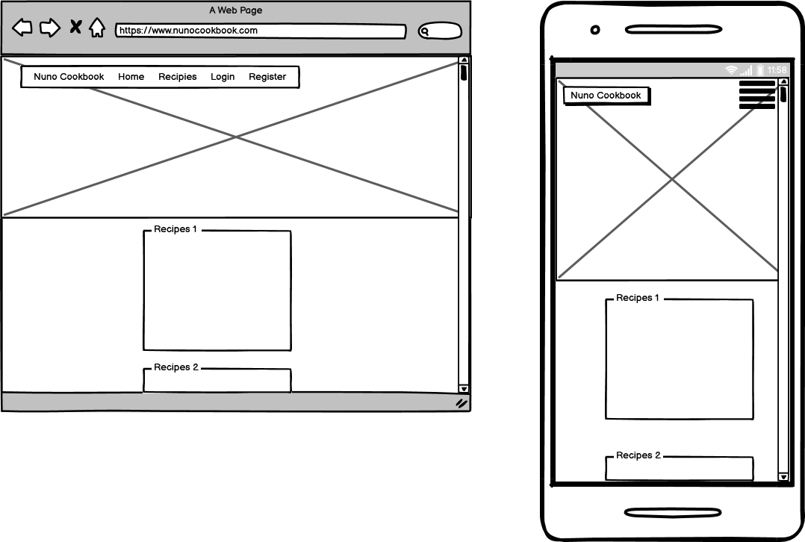
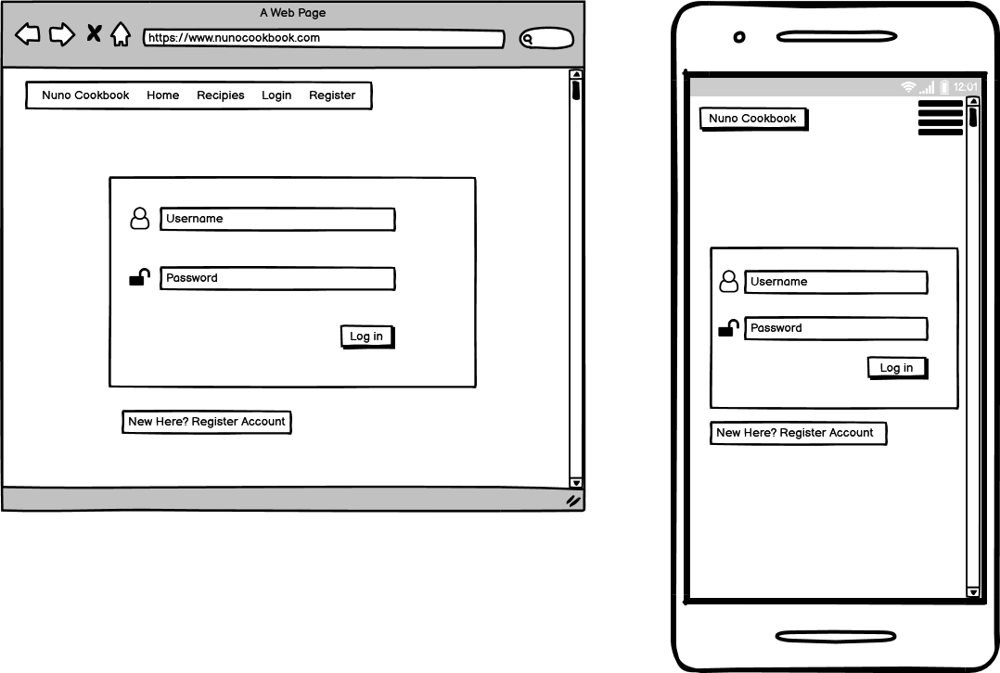

# Nuno Cookbook - Milestone Project

Deployed page goes here ->

Collection of Various kinds of recipes.
This project is dedicated to users who are willing to learn cooking.
It contains various kinds of recipes and user can upload their own recipes too.
 
## UX
 
This website consists of a user friendly layout. 

It's built for two kind of users:

1. One who wants learn Cooking (To be a chef)
2. One who wants to teach Cooking (Wants to share their talent)

Some Users will visit the site to learn new recipes whereas others visit to upload their recipies so that other users can learn and appreciate their talent.

## Wireframes 

#### Homepage



#### Login



## Features

- User can add new recipies using their name and email.
- User can view all kind of recipes in website uploaded by him or other users
- User can edit recipe uploaded by him
- User can delete already added recipe uploaded by him
- User can filter recipies uploaded by him only. 

### Features Left to Implement


## Testing
Most of the applications testing was done throughout development, most of which was manual tests. I will outline most of what I did below for documentation purposes.


## Technologies Used

- [Python](https://www.python.org/doc/)
    - The project uses **Python** as backend.
    
- [Flask](https://flask.palletsprojects.com/en/1.1.x/)
    - The project uses **Flask** framework to built a website.
  
 - [JQuery](https://jquery.com)
    - The project uses **JQuery** to simplify DOM manipulation.
   
 - [Materialize](https://materializecss.com/)
    - The project uses **Materialize** to build responsive and creative site.
    
- [MONGO DB](https://docs.mongodb.com/)
    - The project uses **Mongo DB** to store and retrieve the data.
   

### Testing


## Deployment 
Getting my application ready for deployment consisted of the following: - 
1. Removing all my hard-coded environment variables to project my keys and secrets. These were placed in the heroku Config Vars for production.
2. Ensuring the applications requirements.txt is up-to-date with all the latest packages installed for my app being noted on this file. 
	**The command to update requirements**
		```
		pip3 freeze > requirements.txt
		```
3. Set up the Procfile - *A Procfile is required by Heroku in order to tell the service worker what command to run for my application to start.*
4. Set Flask's debugging to False.
5. Push all my latest production ready code to GitHub ready for deployment via Heroku's GitHub function where you can deploy from GitHub the production ready app.

**Upon successful deployment Heroku will give you the URL that is hosted your app**

*Upon unsuccessful deployment Heroku will log the cause of the error and this is view able in the 'view log' section on the Heroku website. Here you will find a detailed report of what has cause your application not to be deployed successfully. *

### Expanding on my project

To get set up with a copy of my project you can do these multiple ways. 

**Via GitHub** -  
1. You can manually download locally to your machine and then upload to your preferred IDE. 
2. Install the projects requirements.txt using `pip3 install -r requirements.txt`
3. You will need to update a few environment variables before we can run the app.
	1. `app.config["MONGO_DBNAME"] = "my-cookbook-nuno"`
	2. `app.config["MONGO_URI"] = os.getenv("MONGO_URI", "monogodb://localhost")`
	3. `app.config["SECRET_KEY"] = os.getenv("SECRET_KEY")`
4. Once the above steps are complete you can try run the application using `python3 main.py`

**Via the CLI** -
1. Clone my repo via Git using the following command 
2. Install the projects requirements.txt using `pip3 install -r requirements.txt`
3. You will need to update a few environment variables before we can run the app.
	1. `app.config["MONGO_DBNAME"] = "my-cookbook-nuno"`
	2. `app.config["MONGO_URI"] = os.getenv("MONGO_URI", "monogodb://localhost")`
	3. `app.config["SECRET_KEY"] = os.getenv("SECRET_KEY")`
4. Once the above steps are complete you can try run the application using `python3 app.py`