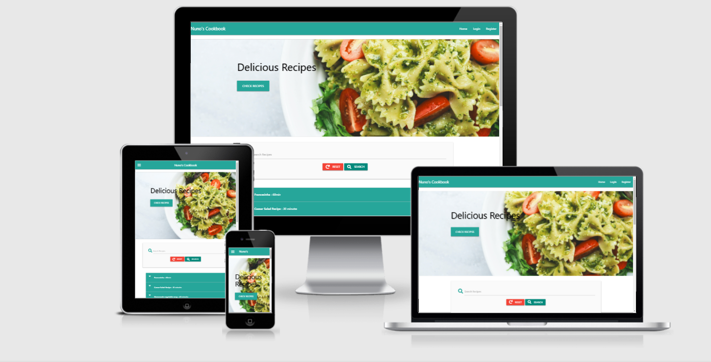
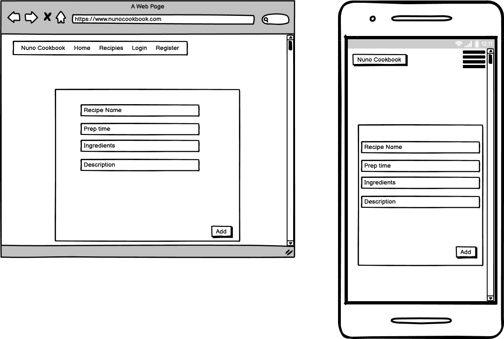
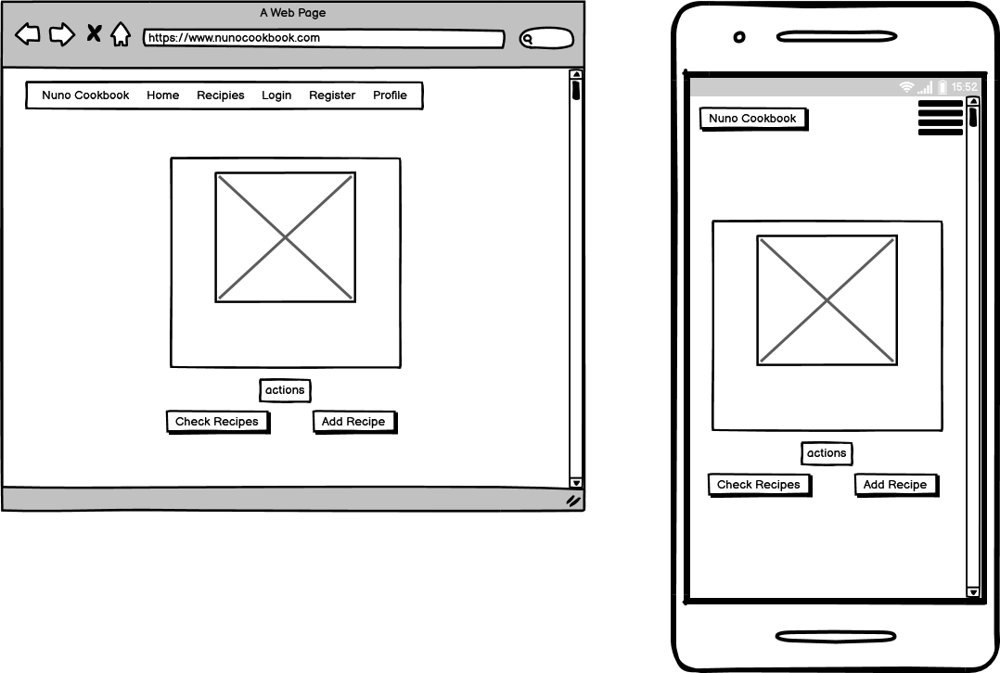
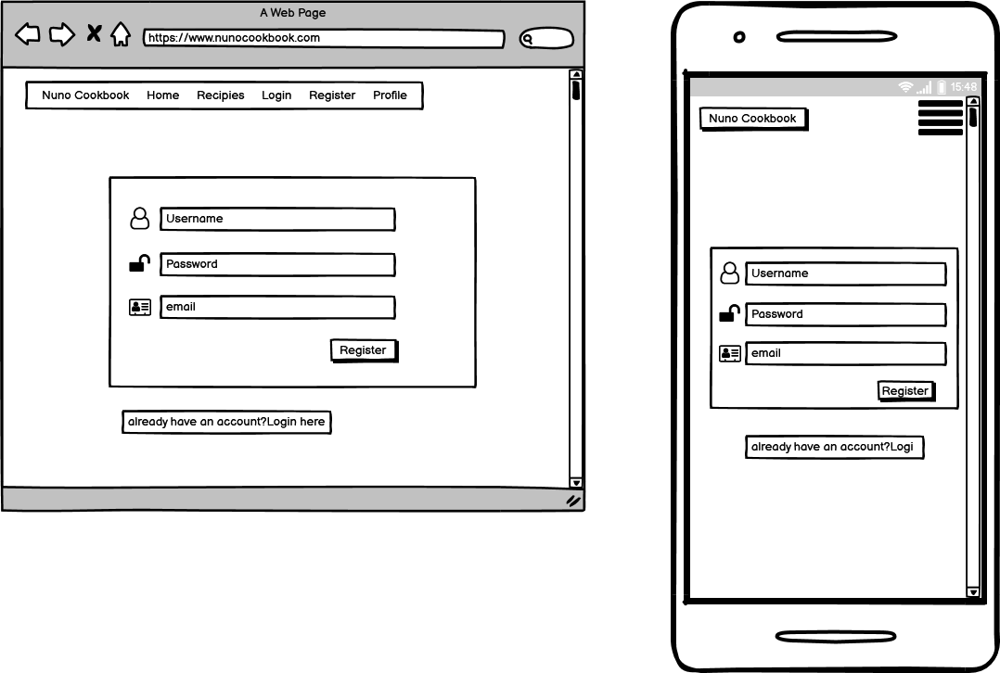

# Nuno Cookbook - Milestone Project



[Deployed page](https://my-cookbook-nuno.herokuapp.com/)

---
## Project description

- What is 'Cookbook | Cookbook Website' - It's an app built with Flask and MongoDB. In this application I use technologies learnt on my coding journey to demonstrate how a document-based database can be utilise efficiently and effectively to create simple yet effective scalable apps on the web.
---
## UX
 
This website consists of a user friendly layout and fully responsive. 
It's built for two kind of users:

1. One who wants learn Cooking (To be a chef)
2. One who wants to teach Cooking (Wants to share their talent)

I wanted to create a seamless app for people to be able to easily store recipes.
The app is designed to allow for users to create, store and manage recipes. 
Lots of people may use cookbooks to refer from when cooking a meal, this app allows user to then store they're cookbook recipes into one place.

---
## Wireframes 

#### Homepage


---
#### Login


---

#### Add Recipe


---

#### Profile


---

#### Register


---

## Features

- User can add new recipies using their name and email.
- User can view all kind of recipes in website uploaded by him or other users
- User can edit recipe uploaded by him
- User can delete already added recipe uploaded by him
- User can search recipies. 

---
### Features Left to Implements
- Adding an online Store, so that is possible to sell recipe books and kitchen utensils
---

## Technologies Used

- [Python](https://www.python.org/doc/)
    - The project uses **Python** as backend.
    
- [Flask](https://flask.palletsprojects.com/en/1.1.x/)
    - The project uses **Flask** framework to built a website.
  
 - [JQuery](https://jquery.com)
    - The project uses **JQuery** to simplify DOM manipulation.
   
 - [Materialize](https://materializecss.com/)
    - The project uses **Materialize** to build responsive and creative site.
    
- [MONGO DB](https://docs.mongodb.com/)
    - The project uses **Mongo DB** to store and retrieve the data.
   

### Testing
Most of the applications testing was done throughout development, most of which was manual tests. I will outline most of what I did below for documentation purposes.
Login page

---
**Testing Flask** 
- Within my settings I had flask's debugger set to 
```python
debug=True
```
This is so when Flask ever encounters an error the application knows to display this error in the view to give indication of what caused the app to crash.

---
**Testing Flask Views** 
- In Flask each app's route uses a view template from my app structure these views were tested throughout every stage within my development process. Where needed I would test each view worked as expected when added new code or functionality to my app.

---
**Testing the database** 
- Getting my data collections right was the trickiest part of this project. As through developing my application my database schema was constantly changing to the requirements of my app

---

**Testing CRUD**

**CREATE**
- To test my create functionality of my app I would continuously fill out a recipe form and test that the route when posting create a new recipe within my recipe collection and that all the fields I needed were created successfully.

**READ**
- All recipes are displayed in the index page, no issues found.

**UPDATE**
- Tested the edit functionality so that users could edit their recipes, also included security so that only the user that created the recipe could edit

**DELETE**
- Testing the delete function in my app was a case of creating the route and then testing that route within the browser, I would grab a recipe ID and then enter the URL needed for that route to perform. After deleting a record, I would flash a message for the user to be notified and also print a message to the terminal. To ensure the recipe was delete I would check in my view all recipes page along with checking the Atlas website. 

Once my CRUD functionality was in place, I tested each form multiple times and tried to break each field or manipulate each form to perform unexpected. I have had my apps functionality tested multiple times by friends, family. Where bugs were identified I made a note and fixed each issue.

From this I am confident that my CRUD functionality in my app is all working and without any bugs or errors being produced.

---
**Browser compatibility** 

My app will be fully functional across all major modern browsers. I have tested my app on the following browsers.

- [Chrome](https://www.google.com/chrome/)
- [Firefox](https://www.mozilla.org/en-GB/firefox/new/)
- [Opera](https://www.opera.com/)
- [IE Edge](https://www.microsoft.com/en-gb/windows/microsoft-edge)
- [IE](https://www.microsoft.com/en-gb/windows/microsoft-edge)
- [Safari](https://support.apple.com/en_GB/downloads/safari)
- [Chrome Mobile](https://chrome.en.softonic.com/)

---
## Validation
- [W3C Validation Service](https://validator.w3.org/#validate_by_input)
    - All errors related to jinja2 across all pages

- [CSS Validation Service](https://jigsaw.w3.org/css-validator/)
    - No errors found all passed

- [PEP8](http://pep8online.com/)
    - All python code pep8 compliant

---
## Deployment 

##### GitHub Pages

1. A local project was created in GitHub with a new repository called 'Mind-Gym-Project'
2. The project had regular push and detailed commits which were pushed to the GitHub website before deployment
3. The project was deployed by logging in to GitHub and locating the [GitHub Repository](https://github.com/NunoCos/Nuno_Cookbook)

Getting my application ready for deployment consisted of the following: - 

1. Removing all my hard-coded environment variables to project my keys and secrets. These were placed in the heroku Config Vars for production.
2. Ensuring the applications requirements.txt is up-to-date with all the latest packages installed for my app being noted on this file. 
	**The command to update requirements**
		```
		pip3 freeze > requirements.txt
		```
3. Set up the Procfile - *A Procfile is required by Heroku in order to tell the service worker what command to run for my application to start.*
4. Set Flask's debugging to False.
5. Push all my latest production ready code to GitHub ready for deployment via Heroku's GitHub function where you can deploy from GitHub the production ready app.

**Upon successful deployment Heroku will give you the URL that is hosted your app**

*Upon unsuccessful deployment Heroku will log the cause of the error and this is view able in the 'view log' section on the Heroku website. Here you will find a detailed report of what has cause your application not to be deployed successfully. *

---
### Expanding on my project

To get set up with a copy of my project you can do these multiple ways. 

**Via GitHub** -  
1. You can manually download locally to your machine and then upload to your preferred IDE. 
2. Install the projects requirements.txt using `pip3 install -r requirements.txt`
3. You will need to update a few environment variables before we can run the app.
	1. `app.config["MONGO_DBNAME"] = "my-cookbook-nuno"`
	2. `app.config["MONGO_URI"] = os.getenv("MONGO_URI", "monogodb://localhost")`
	3. `app.config["SECRET_KEY"] = os.getenv("SECRET_KEY")`
4. Once the above steps are complete you can try run the application using `python3 app.py`

**Via the CLI** -
1. Clone my repo via Git using the following command 
2. Install the projects requirements.txt using `pip3 install -r requirements.txt`
3. You will need to update a few environment variables before we can run the app.
	1. `app.config["MONGO_DBNAME"] = "my-cookbook-nuno"`
	2. `app.config["MONGO_URI"] = os.getenv("MONGO_URI", "monogodb://localhost")`
	3. `app.config["SECRET_KEY"] = os.getenv("SECRET_KEY")`
4. Once the above steps are complete you can try run the application using `python3 app.py`

---
## Credit
[Traversy Media](https://www.youtube.com/watch?v=MaP3vO-vEsg)
- Code for slider taken from this tutorial and adapted to my project

[Net Ninja](https://www.youtube.com/watch?v=bO3S4u47YsY)
- Recipe of the week code taken from this tutorial and adapted to my project

[Code Institute](https://codeinstitute.net/)
- CRUD functionality based on Task Manager functionality and Authentication process

[Stack Overflow](https://stackoverflow.com/questions/19179424/how-to-wrap-text-around-an-image-using-html-css/19179519)
- Code for resizing image inside collapsible and adapted to my code

[W3schools](https://www.w3schools.com/howto/tryit.asp?filename=tryhow_js_scroll_to_top)
- Code for back to top button in main index page
---
## Resources Used
- [Fontawesome Icons](https://fontawesome.com/)
- [Flask Docs](http://flask.pocoo.org/docs/1.0/)
- [Mongo Docs](https://docs.mongodb.com/)
- [Slack](https://slack.com/intl/en-gb/)
- [Google](https://google.com/)
- [YouTube](https://www.youtube.com/)
- [Unsplash](https://unsplash.com/)

---

## Acknowledgements
I would like to thank my mentor, **Spencer Barriball**, for his help on this project and for providing me some tools that made my project easier,
**Slack Community** for their assistance with minor coding issues and **Tutor Support** for for providing support that really helped me out.


---
## Support

For any issues or information, please email me on nuno18_9@hotmail.com


Thank you for the time reviewing my Readme file and hope you enjoy my project.